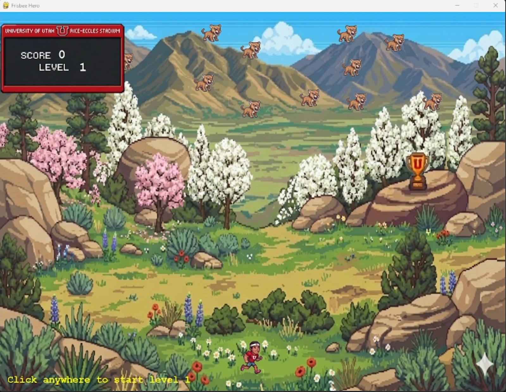
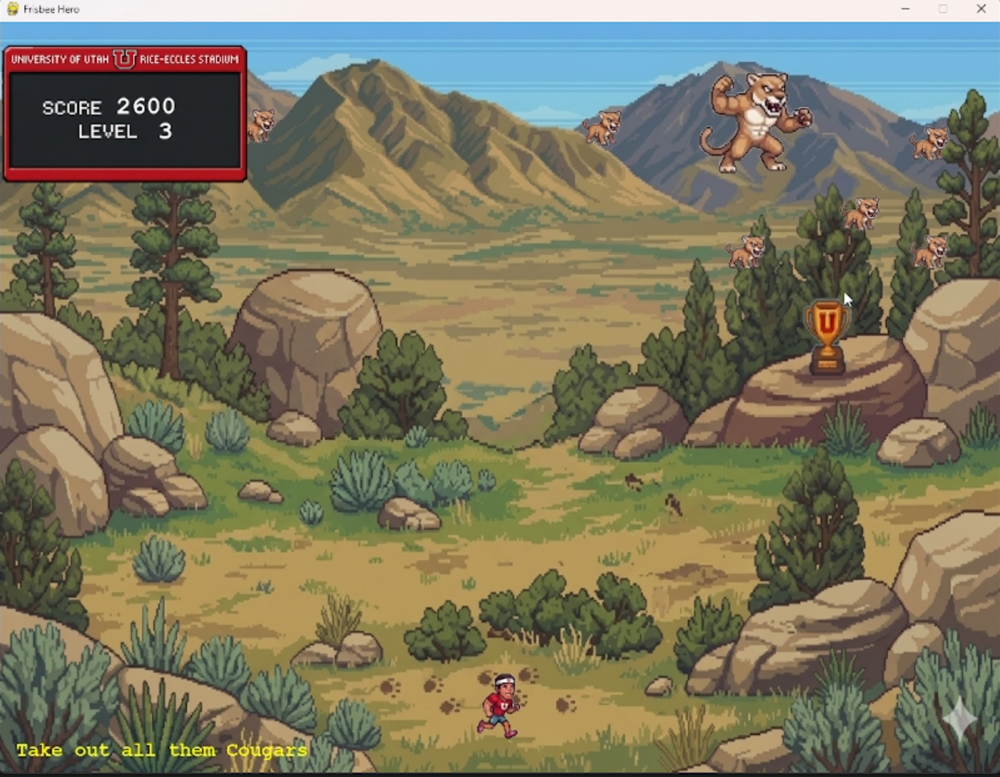

# Frisbee Hero — 2D Arcade Game in Python

Frisbee Hero is a 2D arcade-style game built in Python for my CS1400 programming course. The project focuses on game logic, user interaction, collision detection, level progression, scoring, enemy behavior, and power-up mechanics.

The game includes multiple levels, randomized enemy placement, boss enemies, player states, score tracking, background changes, and win/loss conditions. Through this project, I practiced writing organized Python code, debugging gameplay issues, managing image assets, and building an interactive program from concept to playable demo.

## Features

- 2D arcade-style gameplay
- Multiple levels with increasing difficulty
- Randomized enemy placement
- Boss enemy encounters
- Score tracking
- Player win/loss states
- Power-up mechanics
- Seasonal background changes
- Image-based game assets
- Collision detection
- Event handling and player input

## Skills Demonstrated

- Python programming
- Pygame
- Game development
- Debugging
- Collision detection
- Event handling
- Conditional logic
- Loops and functions
- Problem-solving
- Project organization
- Technical documentation

## Technologies Used

- Python
- Pygame
- GitHub

## What I Learned

This project strengthened my understanding of programming fundamentals while giving me experience building an interactive application from concept to playable demo.

I practiced organizing code, managing image assets, debugging gameplay issues, and designing logic for enemies, scoring, power-ups, level progression, and player states.

## How to Run

1. Download or clone the repository.
2. Make sure Python is installed.
3. Install Pygame:

```bash
pip install pygame
```

4. Open the main project folder:

```bash
cd "Frisbee Hero — 2D Arcade Game in Python"
```

5. Run the game:

```bash
python adventure.py
```

## Screenshots

### Start Screen



### Death Screen


### Boss Level



## Project Status

Completed as a course project and portfolio piece.
